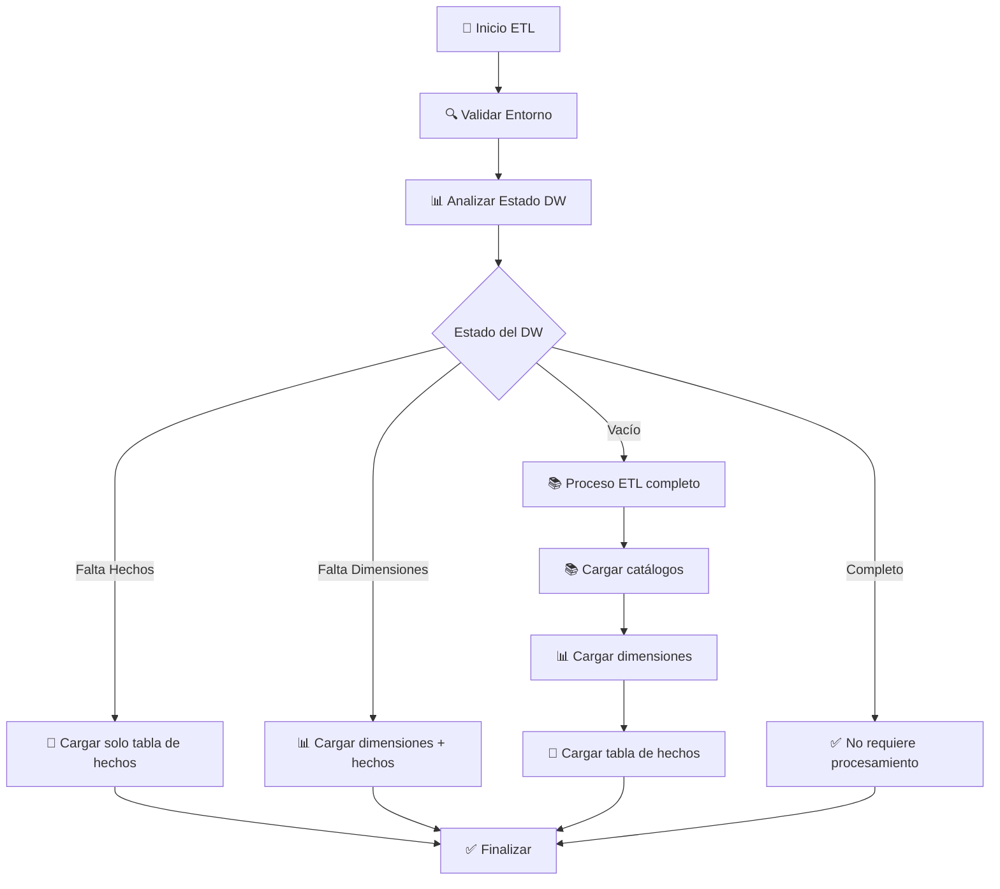

# 🚀 Proyecto ETL - Data Warehouse de Gestión de Proyectos

Sistema ETL inteligente y reproducible para migrar datos de gestión de proyectos de OLTP (base transaccional) a OLAP (data warehouse) usando Python y MySQL.

## 📋 Tabla de Contenidos

- [🎯 Resumen Ejecutivo](#-resumen-ejecutivo)
- [🏗️ Arquitectura del Sistema](#️-arquitectura-del-sistema)
- [⚙️ Configuración e Instalación](#️-configuración-e-instalación)
- [🚀 Uso del Sistema](#-uso-del-sistema)
- [📊 Estado Actual](#-estado-actual)
- [🔧 Mantenimiento](#-mantenimiento)
- [📖 Documentación Adicional](#-documentación-adicional)

## 🎯 Resumen Ejecutivo

### ✨ Características Principales
- **🧠 ETL Inteligente**: Analiza automáticamente el estado y ejecuta solo lo necesario
- **🔄 100% Reproducible**: Puede ejecutarse múltiples veces sin problemas
- **📊 Validación Automática**: Verifica integridad de datos en cada paso
- **⚙️ Configuración por Variables de Entorno**: Migrado de config.ini a .env
- **🎯 Filtrado de Datos**: Solo proyectos cerrados/cancelados para análisis histórico

### 📈 Métricas del Data Warehouse
- **10,970+ registros** distribuidos en 15 tablas
- **$5,194,486.38** en ganancias totales analizadas
- **141 proyectos** cerrados/cancelados procesados
- **429 fechas únicas** desde 2018 hasta 2026
- **9 años** de datos históricos listos para BI

## 🏗️ Arquitectura del Sistema

### 📁 Estructura del Proyecto
```
etl_project/
├── 📂 config/
│   └── .env                    # ⚙️ Configuración de BD (variables de entorno)
├── 📂 scripts/
│   ├── etl_main.py            # 🎯 Orquestador principal inteligente
│   ├── etl_help.py            # 📖 Sistema de ayuda
│   ├── etl_status.py          # 🔍 Verificación rápida de estado
│   └── 📂 src/
│       ├── etl_validator.py           # 🔍 Validación de estado del DW
│       ├── etl_catalog_loader.py      # 📚 Carga de catálogos
│       ├── etl_complete_processor.py  # ⚙️ Procesamiento ETL completo
│       ├── db_connector.py            # 🔌 Gestión de conexiones BD
│       └── extract_proyectos.py       # 📤 Extracción de datos filtrados
├── 📂 logs/                   # 📋 Archivos de log del sistema
└── 📂 temp/                   # 🗂️ Archivos temporales de procesamiento
```

### 🔄 Flujo de Procesamiento ETL



## ⚙️ Configuración e Instalación

### 🔧 Prerrequisitos
- Python 3.8+ 
- MySQL 8.0+
- Acceso a las bases de datos origen (OLTP) y destino (OLAP)

### 📦 Dependencias
```bash
pip install mysql-connector-python python-dotenv
```

### ⚙️ Configuración de Base de Datos

#### 1. Crear archivo de configuración
```bash
# Crear archivo config/.env
cp config/.env.example config/.env
```

#### 2. Configurar variables de entorno
```properties
# config/.env
# Base de datos origen (OLTP)
ORIGEN_HOST=192.168.100.133
ORIGEN_USER=etl_user_BD
ORIGEN_PASS=BD321
ORIGEN_DB=gestion_proyectos

# Base de datos destino (OLAP)
DESTINO_HOST=192.168.100.133
DESTINO_USER=etl_user_DW
DESTINO_PASS=DW321
DESTINO_DB=project_dw
```

#### 3. Verificar conectividad
```bash
python scripts/src/db_connector.py
```

### 🛠️ Configuración del Data Warehouse
El esquema del data warehouse debe estar creado previamente. Ver documentación en `DW_STRUCTURE_ANALYSIS.md` para la estructura completa.

## 🚀 Uso del Sistema

### 🎯 Comandos Principales

#### Ejecución Inteligente (Recomendado)
```bash
python scripts/etl_main.py
```
- Analiza automáticamente el estado actual
- Ejecuta solo lo que es necesario
- Tiempo típico: 1-3 segundos si ya está completo

#### Reconstrucción Completa
```bash
python scripts/etl_main.py --rebuild
```
- Limpia y reprocesa todo el data warehouse
- Útil para actualizaciones de datos
- Tiempo típico: 2-5 minutos

#### Verificación Rápida
```bash
python scripts/etl_status.py
```
- Estado conciso del data warehouse
- Útil para monitoreo y scripts automatizados

#### Ver Ayuda Completa
```bash
python scripts/etl_main.py --help
```

### 📊 Estados Posibles del Sistema

| Estado | Descripción | Acción Automática |
|--------|-------------|-------------------|
| ✅ **COMPLETO** | Todo funcionando | No hace nada (1-2 seg) |
| 🔶 **NECESITA_HECHOS** | Solo falta tabla de hechos | Carga hechos únicamente |
| 🔷 **NECESITA_DIMS** | Faltan dimensiones y hechos | Carga dimensiones + hechos |
| 🔴 **NECESITA_TODO** | Data warehouse vacío | Proceso ETL completo |

### 🎯 Filtros de Datos Implementados

El sistema filtra automáticamente:
- **Proyectos**: Solo estados "Cerrado" o "Cancelado"
- **Contratos**: Solo estados "Cerrado" o "Cancelado"
- **Empleados**: Solo los que trabajaron en proyectos relevantes
- **Clientes**: Solo los asociados a proyectos relevantes

## 📊 Estado Actual

### ✅ Funcionalidades Completadas
- [x] Migración completa de config.ini a .env
- [x] Sistema ETL inteligente con validación automática
- [x] Filtrado de datos por estado de proyecto
- [x] Población completa del data warehouse (15 tablas)
- [x] Cálculos correctos de ganancias y métricas financieras
- [x] Dimensión tiempo funcionando (429 fechas únicas)
- [x] Sistema de logging y manejo de errores
- [x] Documentación completa y ayuda integrada

### 📈 Métricas Actuales del Data Warehouse
```
📊 DIMENSIONES PRINCIPALES:
✅ dim_clientes             63 registros
✅ dim_empleados           400 registros
✅ dim_proyectos           141 registros
✅ dim_tareas             4970 registros
✅ dim_tiempo              429 registros
✅ dim_finanzas           3956 registros
✅ dim_tipo_riesgo         810 registros
✅ dim_severidad             3 registros

📊 SUBDIMENSIONES:
✅ subdim_anio              38 registros
✅ subdim_mes               12 registros
✅ subdim_dia                7 registros

💰 TABLA DE HECHOS:
✅ hechos_proyectos        141 registros
   📈 Proyectos rentables: 141
   💵 Ganancia mínima: $9,962.34
   💰 Ganancia máxima: $98,810.13
   📊 Ganancia promedio: $36,840.33
   💎 Ganancia total: $5,194,486.38
```

## 🔧 Mantenimiento

### 🔍 Verificación de Salud del Sistema
```bash
# Estado rápido
python scripts/etl_status.py

# Validación completa
python scripts/etl_main.py
```

### 🗂️ Gestión de Logs
```bash
# Ver logs recientes (si se implementa logging a archivos)
tail -f logs/etl.log

# Limpiar logs antiguos
rm -rf logs/*.log
```

### 🔄 Actualización de Datos
```bash
# Actualizar solo si hay nuevos datos
python scripts/etl_main.py

# Forzar actualización completa
python scripts/etl_main.py --rebuild
```

### 🛠️ Solución de Problemas Comunes

#### Error de Conexión a BD
```bash
# Verificar conectividad
python scripts/src/db_connector.py

# Verificar variables de entorno
cat config/.env
```

#### Data Warehouse Inconsistente
```bash
# Reconstruir completamente
python scripts/etl_main.py --rebuild
```

#### Verificar Estructura de Tablas
```bash
# Analizar estructura del DW
python scripts/src/etl_validator.py
```

## 📖 Documentación Adicional

### 📚 Archivos de Documentación Especializados

| Archivo | Descripción |
|---------|-------------|
| `README_ETL.md` | Documentación técnica detallada del sistema ETL |
| `MIGRATION_GUIDE.md` | Guía completa de migración de config.ini a .env |
| `DW_STRUCTURE_ANALYSIS.md` | Análisis detallado de la estructura del data warehouse |
| `ETL_IMPLEMENTATION_PLAN.md` | Plan de implementación y mapeo de datos |

### 🔗 Enlaces de Interés
- [Documentación de mysql-connector-python](https://dev.mysql.com/doc/connector-python/en/)
- [Documentación de python-dotenv](https://pypi.org/project/python-dotenv/)

## 🎯 Próximos Pasos Sugeridos

### 📈 Análisis de Inteligencia de Negocios
Con el data warehouse funcionando, puedes:
1. **Conectar herramientas de BI** (Power BI, Tableau, etc.)
2. **Crear dashboards** de análisis de proyectos
3. **Implementar métricas KPI** de gestión
4. **Análisis de rentabilidad** por cliente/empleado/período

### 🔄 Mejoras del Sistema ETL
- Implementar logging a archivos detallado
- Agregar notificaciones por email en errores
- Crear scheduler automático (cron jobs)
- Implementar respaldos automáticos del DW

---

## 📞 Soporte

Para soporte o preguntas:
```bash
# Ver ayuda del sistema
python scripts/etl_main.py --help

# Verificar estado actual
python scripts/etl_status.py
```

**Estado del Proyecto**: ✅ **PRODUCCIÓN - COMPLETAMENTE FUNCIONAL**

---
*Última actualización: Octubre 2025*
